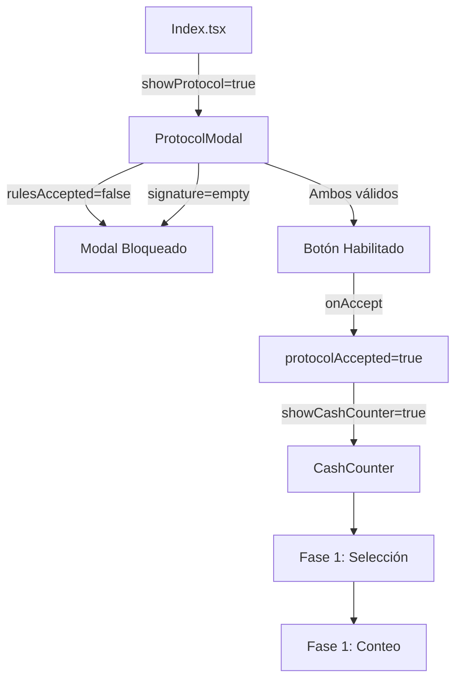

# Reporte de Análisis: Modal del Paso 1 - Información Inicial

## Resumen Ejecutivo

El modal del Paso 1 (ProtocolModal) es el punto de entrada crítico del sistema CashGuard Paradise. Actúa como una barrera de seguridad anti-fraude y garantiza que los usuarios comprendan y acepten las reglas del protocolo antes de proceder con el conteo de caja.

## Arquitectura y Componentes

### 1. Componente Principal: ProtocolModal
**Ubicación:** `/src/components/ProtocolModal.tsx`

El modal está construido usando:
- **Framework UI:** shadcn/ui con Radix UI primitives
- **Animaciones:** Framer Motion para transiciones suaves
- **Estilización:** Tailwind CSS con tema glass morphism personalizado

### 2. Flujo de Integración

```
Index.tsx → ProtocolModal → CashCounter → Fase 1 (Conteo)
```

El modal se activa desde la página principal (`Index.tsx`) cuando el usuario hace clic en "Iniciar Corte de Caja".

## Funcionamiento Detallado

### Ciclo de Vida del Modal

1. **Activación:** Usuario hace clic en "Iniciar Corte de Caja" en Index.tsx
2. **Renderización:** Modal aparece con animación fade-in y scale-in
3. **Validación:** Requiere checkbox y firma digital
4. **Confirmación:** Desbloquea acceso a CashCounter
5. **Cierre:** Transición a la siguiente fase

### Estado y Props

```typescript
interface ProtocolModalProps {
  isOpen: boolean;      // Control de visibilidad
  onClose: () => void;  // Callback para cerrar
  onAccept: () => void; // Callback para aceptar protocolo
}
```

**Estado interno:**
- `rulesAccepted`: Boolean para checkbox de aceptación
- `signature`: String para firma digital

### Reglas del Protocolo

El modal presenta 6 reglas clasificadas en críticas y no críticas:

**Reglas Críticas:**
1. Prohibido usar teléfonos o calculadoras
2. Un solo conteo permitido - sin recuentos
3. Cajero ≠ Testigo (validación cruzada)
4. Campos se bloquean después del cálculo

**Reglas Estándar:**
1. Todos los campos obligatorios
2. Alerta automática si faltante > $3.00

## Análisis de Estilos y Responsive Design

### Clases CSS Aplicadas

El modal utiliza múltiples capas de estilización:

1. **Clase base:** `glass-modal` con efecto blur y saturación
2. **Clase específica:** `protocol-modal-content` para centrado perfecto
3. **Responsive:** Breakpoints específicos para móvil, tablet y desktop

### Configuración Responsive (v1.0.2)

```css
- Móvil (<640px): 95vw ancho, 90vh altura máxima
- Tablet (641-768px): 85vw ancho, máximo 500px
- Desktop (>769px): Auto ancho, máximo 600px
```

## Hallazgos y Posibles Mejoras

### ✅ Fortalezas Identificadas

1. **Seguridad Anti-Fraude Robusta**
   - Validación de firma digital obligatoria
   - Checkbox de aceptación requerido
   - Botón deshabilitado hasta cumplir requisitos

2. **UX/UI Bien Diseñada**
   - Animaciones suaves con Framer Motion
   - Diseño glass morphism atractivo
   - Iconografía clara con Lucide React
   - Responsive design optimizado

3. **Accesibilidad**
   - DialogDescription para screen readers
   - Labels asociados correctamente
   - Estados focus visibles

### ⚠️ Bugs Potenciales Identificados

1. **Bug de Validación de Firma**
   - **Problema:** La validación solo verifica `signature.trim()` pero no valida caracteres mínimos
   - **Impacto:** Usuario podría ingresar un solo carácter como firma
   - **Severidad:** Media
   - **Solución sugerida:** Validar longitud mínima (ej: 5 caracteres)

2. **Falta de Persistencia de Estado**
   - **Problema:** Si el usuario cierra accidentalmente el modal, pierde la firma ingresada
   - **Impacto:** Fricción en UX si hay cierre accidental
   - **Severidad:** Baja
   - **Solución sugerida:** Mantener estado temporal en localStorage

3. **Botón de Cierre Oculto**
   - **Problema:** Clase `[&>button]:hidden` oculta el botón X nativo
   - **Impacto:** Usuario solo puede cerrar con botón "Cancelar"
   - **Severidad:** Baja
   - **Nota:** Parece intencional para forzar decisión consciente

### 🔍 Observaciones de Seguridad

1. **Sin Registro de Intentos**
   - No se registran intentos de cierre o rechazo del protocolo
   - Podría ser útil para auditoría

2. **Falta Timestamp de Aceptación**
   - No se guarda cuándo se aceptó el protocolo
   - Importante para trazabilidad

3. **Sin Validación de Identidad Real**
   - La firma digital es solo texto, no hay verificación adicional
   - Considerar integración con sistema de autenticación

## Flujo de Datos Completo



## Recomendaciones de Mejora

### Alta Prioridad

1. **Validación de Firma Mejorada**
```typescript
const isValidSignature = signature.trim().length >= 5;
const handleAccept = () => {
  if (rulesAccepted && isValidSignature) {
    // Guardar timestamp
    const acceptedAt = new Date().toISOString();
    onAccept({ signature, acceptedAt });
  }
};
```

2. **Registro de Auditoría**
```typescript
// Agregar logging de eventos
const logProtocolEvent = (event: 'viewed' | 'accepted' | 'rejected') => {
  const eventData = {
    event,
    timestamp: new Date().toISOString(),
    signature: event === 'accepted' ? signature : null
  };
  // Enviar a sistema de logs
};
```

### Media Prioridad

3. **Persistencia Temporal**
```typescript
// Guardar estado temporal
useEffect(() => {
  const saved = localStorage.getItem('protocol_draft');
  if (saved) setSignature(saved);
}, []);

useEffect(() => {
  if (signature) {
    localStorage.setItem('protocol_draft', signature);
  }
}, [signature]);
```

4. **Feedback Visual Mejorado**
- Agregar indicador de progreso (1/6 reglas leídas)
- Tooltip explicativo en cada regla crítica
- Animación de éxito al aceptar

### Baja Prioridad

5. **Métricas de Interacción**
- Tiempo de lectura del protocolo
- Clicks en reglas específicas
- Tasa de abandono

## Conclusión

El modal del Paso 1 está bien implementado y cumple su función de barrera anti-fraude efectivamente. Los bugs identificados son menores y no comprometen la funcionalidad core. Las mejoras sugeridas apuntan principalmente a fortalecer la auditoría y mejorar la experiencia de usuario.

### Estado Actual: ✅ FUNCIONAL

- **Bugs Críticos:** 0
- **Bugs Medios:** 1 (validación de firma)
- **Bugs Menores:** 2
- **Calificación General:** 8.5/10

El componente está listo para producción con las consideraciones mencionadas.

---

**Documento generado:** 2025-08-20
**Versión analizada:** v1.0.2
**Analista:** Claude Code Assistant