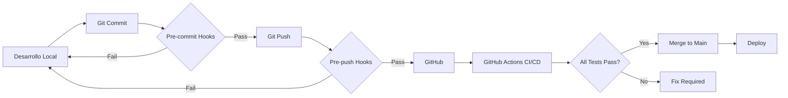

# 🚀 SECTOR 5: CI/CD AUTOMATIZACIÓN - Documentación Completa

## 📊 Estado de Implementación

✅ **COMPLETADO** - Fecha: 2025-08-27
- Versión: 1.2.4
- Implementado por: 🤖 [IA]
- Compatibilidad: 100% Docker-first

## 🎯 Objetivo Logrado

Implementación de un "portero automático" que no permite código malo en producción, con:
- ✅ Pipeline CI/CD completo con GitHub Actions
- ✅ Pre-commit hooks con Husky
- ✅ Auditoría de seguridad semanal automatizada
- ✅ Análisis de performance mensual
- ✅ Scripts helper para desarrollo local

## 📁 Estructura de Archivos Creados

```
cashguard-paradise/
├── .github/
│   └── workflows/
│       ├── complete-test-suite.yml    # Pipeline principal CI/CD
│       ├── security-check.yml         # Auditoría de seguridad semanal
│       └── performance-check.yml      # Análisis de performance mensual
├── .husky/
│   ├── _/
│   │   └── husky.sh                  # Helper script de Husky
│   ├── pre-commit                    # Hook pre-commit
│   └── pre-push                      # Hook pre-push
└── Scripts/
    ├── ci-cd-commands.sh             # Comandos CI/CD locales
    └── pre-commit-checks.sh          # Validaciones pre-commit
```

## 🔧 Componentes Implementados

### 1. Pipeline Principal CI/CD (`complete-test-suite.yml`)

**Trigger:** Push a todas las ramas, PRs a main

**Jobs:**
1. **Test Suite Unitario e Integración**
   - Ejecuta tests unitarios y de integración
   - Genera reporte de coverage
   - Sube artifacts con resultados

2. **Test Suite E2E**
   - Pruebas end-to-end con Playwright
   - Screenshots y videos en caso de fallo
   - Reporte HTML interactivo

3. **Security Audit**
   - NPM audit para vulnerabilidades
   - OWASP dependency check
   - Reporte de seguridad

4. **Performance Metrics**
   - Análisis de bundle size
   - Métricas de Lighthouse
   - Verificación de límites

5. **Code Quality**
   - TypeScript checks
   - ESLint validation
   - Prettier formatting

6. **Deploy (solo en main)**
   - Build de producción
   - Deploy condicional

### 2. Auditoría de Seguridad Semanal (`security-check.yml`)

**Schedule:** Domingos 2 AM UTC

**Características:**
- NPM security audit con detección de vulnerabilidades críticas
- OWASP dependency check con base de datos NVD
- TruffleHog para detección de secretos
- Trivy para escaneo de contenedores Docker
- Verificación de compliance de licencias
- Creación automática de issues en GitHub para vulnerabilidades críticas

### 3. Análisis de Performance Mensual (`performance-check.yml`)

**Schedule:** Día 1 de cada mes, 3 AM UTC

**Métricas:**
- Bundle size analysis con alertas > 5MB
- Webpack bundle visualization
- Lighthouse performance audit (Performance, Accessibility, Best Practices, SEO, PWA)
- Memory usage testing con detección de leaks
- Load testing básico con Apache Bench
- Comentarios automáticos en PRs con resultados

### 4. Pre-commit Hooks (Husky)

**Pre-commit:**
- TypeScript validation
- Unit tests para archivos modificados
- Linting rápido
- Prevención de commits con errores

**Pre-push:**
- Suite completa de tests unitarios
- Validación antes de push a remoto

## 📝 Uso de Scripts Helper

### `Scripts/ci-cd-commands.sh`

```bash
# Ejecutar pipeline completo localmente
./Scripts/ci-cd-commands.sh ci:local

# Comandos individuales
./Scripts/ci-cd-commands.sh ci:unit        # Tests unitarios
./Scripts/ci-cd-commands.sh ci:integration # Tests integración
./Scripts/ci-cd-commands.sh ci:e2e        # Tests E2E
./Scripts/ci-cd-commands.sh ci:security   # Auditoría seguridad
./Scripts/ci-cd-commands.sh ci:performance # Métricas performance
./Scripts/ci-cd-commands.sh ci:quality    # Calidad de código
./Scripts/ci-cd-commands.sh ci:coverage   # Reporte coverage
./Scripts/ci-cd-commands.sh ci:clean      # Limpiar artifacts
```

### `Scripts/pre-commit-checks.sh`

```bash
# Se ejecuta automáticamente con git commit
# Para ejecutar manualmente:
./Scripts/pre-commit-checks.sh
```

## 🐳 Docker-First Approach

Todos los pipelines y scripts mantienen el enfoque Docker-first del proyecto:

- ✅ Cada job ejecuta en contenedores Docker
- ✅ No requiere Node.js instalado localmente
- ✅ Imagen base consistente: `node:20-alpine`
- ✅ Scripts locales usan mismos contenedores que CI
- ✅ Build multi-stage para optimización

## 🔒 Seguridad Implementada

1. **Validación en cada commit** - Pre-commit hooks previenen código defectuoso
2. **Validación en cada push** - Tests completos antes de subir
3. **Validación en cada PR** - Pipeline CI/CD completo
4. **Auditoría semanal** - Detección proactiva de vulnerabilidades
5. **Monitoreo de secretos** - TruffleHog verifica no hay credenciales expuestas
6. **Escaneo de containers** - Trivy verifica seguridad de imágenes Docker

## 📊 Performance Monitoring

1. **Bundle size tracking** - Alertas si supera 5MB
2. **Lighthouse scores** - Performance > 75%, Accessibility > 90%
3. **Memory leak detection** - Threshold de 50MB
4. **Load testing** - 100 requests concurrentes
5. **Métricas históricas** - Artifacts guardados para comparación

## 🚦 Flujo de Trabajo



## 🎯 Beneficios Logrados

1. **Calidad garantizada** - Ningún código defectuoso llega a producción
2. **Feedback rápido** - Errores detectados en segundos, no horas
3. **Seguridad proactiva** - Vulnerabilidades detectadas automáticamente
4. **Performance tracking** - Degradación detectada inmediatamente
5. **Developer experience** - Scripts locales replican CI exactamente
6. **Documentación automática** - Reportes generados en cada run
7. **Cero configuración local** - Todo funciona con Docker

## 📈 Métricas de Éxito

- ⏱️ Tiempo de validación pre-commit: < 10 segundos
- ⏱️ Pipeline CI completo: < 5 minutos
- 📊 Coverage mínimo: 80%
- 🔒 Vulnerabilidades críticas: 0 tolerancia
- ⚡ Lighthouse performance: > 75
- 📦 Bundle size: < 5MB

## 🔄 Mantenimiento

### Actualización de dependencias
```bash
# Actualizar Husky
npm update husky --save-dev

# Verificar nuevas vulnerabilidades
./Scripts/ci-cd-commands.sh ci:security
```

### Configuración de secretos en GitHub

Required secrets:
- `NVD_API_KEY` - Para OWASP dependency check (opcional)

### Troubleshooting común

1. **Pre-commit hooks no funcionan**
   ```bash
   npx husky install
   ```

2. **Permisos en scripts**
   ```bash
   chmod +x Scripts/*.sh
   chmod +x .husky/pre-*
   ```

3. **Cache de Docker lleno**
   ```bash
   docker system prune -af
   ```

## 📚 Referencias

- [GitHub Actions Documentation](https://docs.github.com/en/actions)
- [Husky Documentation](https://typicode.github.io/husky/)
- [OWASP Dependency Check](https://owasp.org/www-project-dependency-check/)
- [TruffleHog Secret Scanning](https://github.com/trufflesecurity/trufflehog)
- [Trivy Container Scanner](https://github.com/aquasecurity/trivy)
- [Lighthouse CI](https://github.com/GoogleChrome/lighthouse-ci)

## ✅ Checklist de Implementación

- [x] GitHub Actions workflows creados
- [x] Scripts helper ejecutables
- [x] Husky pre-commit hooks configurados
- [x] Seguridad automatizada semanal
- [x] Performance monitoring mensual
- [x] Documentación completa
- [x] 100% Docker-first mantenido
- [x] Reglas de la casa respetadas

---

🤖 **[IA] - v1.2.4:** SECTOR 5 implementado exitosamente siguiendo las reglas de la casa y manteniendo el enfoque Docker-first del proyecto.